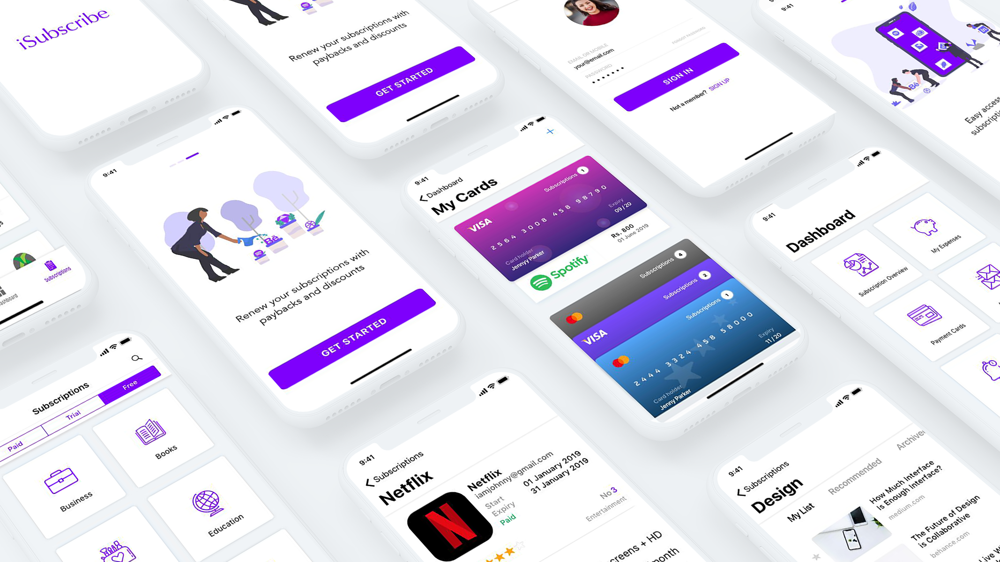

# 💲 Flutter App "iSubscriptions"

A Flutter app based on the design of "Subscription App" *by Amruta A. Panganti*, see more on: [Dribbble](https://dribbble.com/shots/5454871-Subscription-App-Freebie-UI-Kit).

This app is designed for iOS, so I've focused on the Cupertino-widgets. This was quite a new learning experience because these widgets worked slightly different.

## Getting Started 🚀

- Clone the repo
- Install the dependicies
- Run it

## Preview

The app is based on Amruta's design, see a preview of the Flutter app result:

## Version history

| Version |       Date         |             Comments             |
| ------- | ------------------ | -------------------------------- |
| 1.0     | ~November 2019    | Initial release                  |

## Contributing

Feel welcome and free to submit issues, pull requests and features to this repo.

## Support me

I really like to make as much (free) beautiful Flutter apps, so you get inspired!
Hence you can support me by:

⭐️ this repo if you like it.

Thank you in advanced 👍

## Other Flutter Apps

There are other example Apps made with flutter, see more on [Interestinate](https://interestinate.com).

Or the following repo's:
- An Package Manager App made with Flutter: [Package Manager](https://github.com/LiveLikeCounter/Flutter-Package-Manager)
- A Food Delivery Flutter App: [Food Delivery](https://github.com/LiveLikeCounter/Flutter-Food-Delivery)
- An To Do App based on Flutter: [To Do](https://github.com/LiveLikeCounter/Flutter-Todolist)
- A Paypal Redesign made in Flutter: [Paypal Redesign](https://github.com/LiveLikeCounter/Flutter-Paypal-Redesign)

